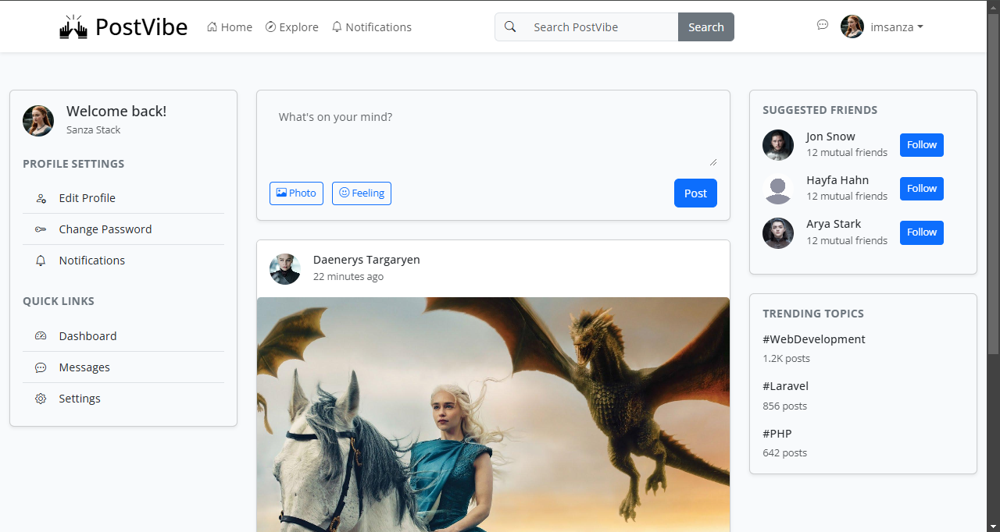
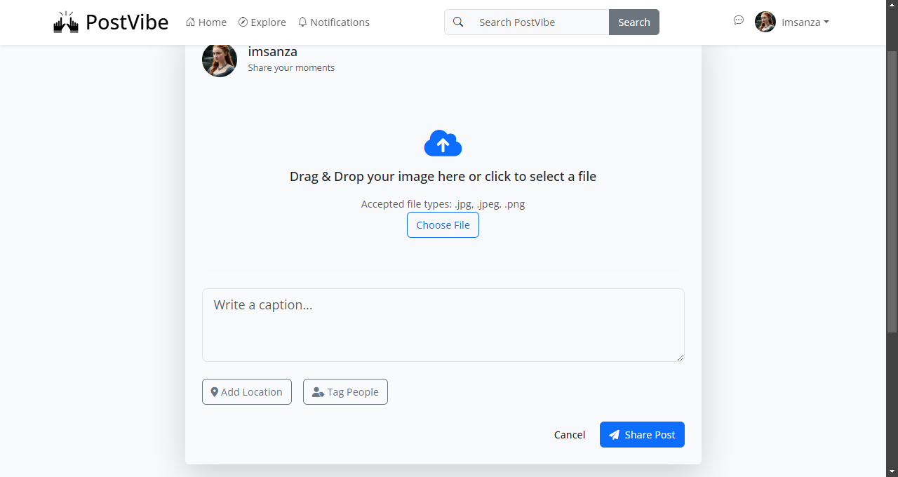
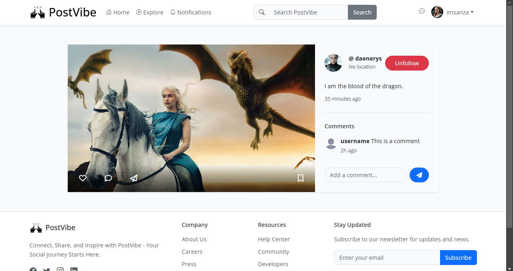
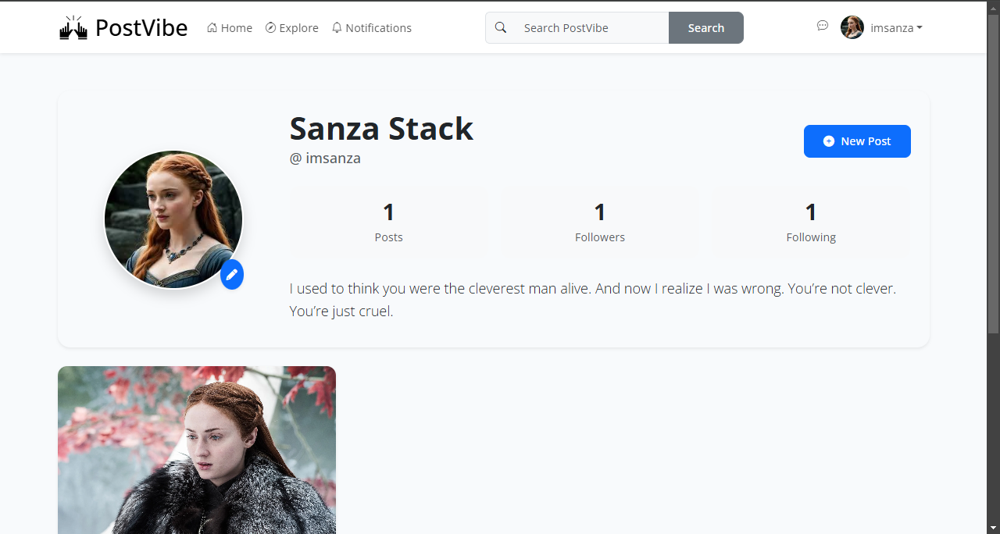
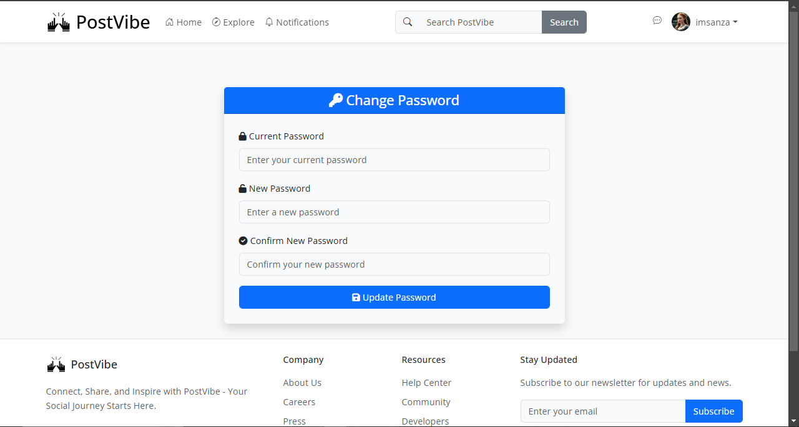

# Laravel Social Media Application

A feature-rich social media platform built with Laravel, enabling users to share posts, connect with others, and manage their digital presence.

## Features

- **Authentication**
  - User registration and login
  - Secure account management
  - Password reset functionality

- **Post Management**
  - Create, edit, and delete posts
  - View personal and community posts
  - Rich text editing capabilities

- **Social Interactions**
  - Like/unlike posts
  - Follow/unfollow users
  - Interactive feed system

- **Profile Management**
  - Customizable user profiles
  - Secure password updates

- **Search Functionality**
  - Search posts and users
  - Filter results by relevance

## Requirements

- PHP >= 8.0
- Composer
- MySQL/SQLite database
- Laravel 10.x

## Installation

1. **Clone the Repository**
   ```bash
   git clone https://github.com/lahiruanushka/laravel-social-media-platform.git
   cd laravel-social-media-platform
   ```

2. **Install Dependencies**
   ```bash
   composer install
   ```

3. **Configure Environment**
   ```bash
   cp .env.example .env
   # Update .env with your database credentials
   ```

4. **Set Up Application**
   ```bash
   php artisan key:generate
   php artisan migrate
   ```

5. **Launch Application**
   ```bash
   php artisan serve
   ```
   Access the application at `http://localhost:8000`

## API Routes

### Authentication
```
GET    /login          - Display login form
GET    /register       - Display registration form
POST   /login          - Process login
POST   /register       - Process registration
GET    /logout         - Handle logout
```

### Posts
```
GET    /posts          - List all posts
GET    /posts/create   - Show post creation form
POST   /posts          - Store new post
GET    /posts/{post}   - View specific post
GET    /posts/{post}/edit   - Edit post form
PATCH  /posts/{post}   - Update post
DELETE /posts/{post}   - Remove post
POST   /posts/{post}/like   - Toggle post like
```

### Profiles
```
GET    /profile/{user}      - View user profile
GET    /profile/{user}/edit - Edit profile form
PATCH  /profile/{user}      - Update profile
```

### User Connections
```
POST   /follow/{user}   - Follow user
DELETE /unfollow/{user} - Unfollow user
```

### Account Management
```
GET    /password/change - Password change form
POST   /password/change - Process password update
```

### Search
```
GET    /search         - Search functionality
```

## Screenshot Gallery

### Home Dashboard

*Central feed displaying recent posts and activity*

### Post Creation Interface

*Intuitive post creation with rich text editing*

### Post View Interface

*Intuitive post view*

### User Profile View

*Personalized profile pages with activity overview*

### Search Interface

*Advanced search with filtering capabilities*

### Password Management

*Secure password update interface*

## Development

### Testing
```bash
php artisan test
```

### Code Style
This project follows PSR-12 coding standards. Format your code using:
```bash
composer format
```

## Contributing

1. Fork the repository
2. Create a feature branch
3. Commit your changes
4. Push to the branch
5. Open a pull request

## License

Released under the [MIT License](LICENSE)

## Support

For support, please open an issue in the GitHub repository or contact the development team.
