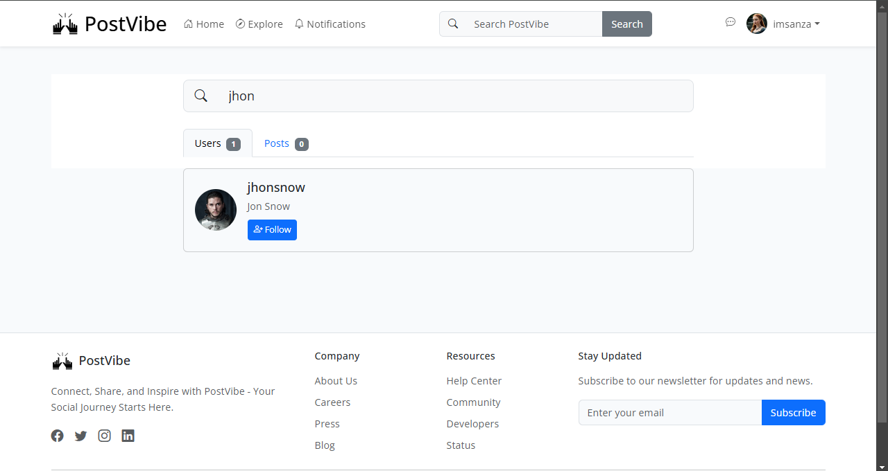

# 🌟 PostVibe-Laravel Social Media Application

PostVibe is a feature-rich social media platform built with Laravel, enabling users to share posts, connect with others, and manage their digital presence.

## ✨ Key Features

### 🔐 Authentication & Security
- Secure user registration and login
- Password reset functionality
- Protected routes and middleware

### 📝 Post Management
- Create, edit, and delete posts
- Image upload and management

### 👥 Social Interactions
- Follow/unfollow users
- Like posts

### 👤 Profile Management
- Customizable user profiles
- Profile picture upload
- Bio and personal information

### 🔍 Search & Discovery
- Advanced user search
- Post content search

### 📊 Additional Features
- Responsive design
  
## 🛠️ Requirements

- PHP >= 8.0
- Composer
- SQLite database
- Laravel 10.x
- Node.js & NPM (for frontend assets)

## 💾 Database Configuration

This application uses SQLite for data storage. To set up the database:

1. Create a new SQLite database:
   ```bash
   touch database/database.sqlite
   ```

2. Update your `.env` file with SQLite configuration:
   ```env
   DB_CONNECTION=sqlite
   DB_DATABASE=/absolute/path/to/database.sqlite
   ```

3. The database schema includes tables for:
   - Users
   - Profiles
   - Posts
   - Likes
   - Follows
   - Password resets

## 🚀 Installation

1. **Clone the Repository**
   ```bash
   git clone https://github.com/lahiruanushka/laravel-social-media-platform.git
   cd laravel-social-media-platform
   ```

2. **Install Dependencies**
   ```bash
   composer install
   npm install
   ```

3. **Configure Environment**
   ```bash
   cp .env.example .env
   # Update .env with your SQLite database path
   ```

4. **Set Up Application**
   ```bash
   php artisan key:generate
   php artisan migrate --seed  # Includes sample data
   npm run dev
   ```

5. **Launch Application**
   ```bash
   php artisan serve
   ```
   Access the application at `http://localhost:8000`

## 📸 Screenshot Gallery

### 🏠 Home Dashboard

*Central feed displaying recent posts and activity*

### ✍️ Post Creation Interface

*Intuitive post creation with rich text editing*

### 👁️ Post View Interface

*Detailed post view with comments and interactions*

### 👤 User Profile View

*Personalized profile pages with activity overview*

### 🔍 Search Interface

*Advanced search with filtering capabilities*

### 🔒 Password Management

*Secure password update interface*

## 🤝 Contributing

1. Fork the repository
2. Create a feature branch (`git checkout -b feature/amazing-feature`)
3. Commit your changes (`git commit -m 'Add amazing feature'`)
4. Push to the branch (`git push origin feature/amazing-feature`)
5. Open a pull request


## 📜 License

Released under the [MIT License](LICENSE)

## 💪 Support

- 📫 For support, please open an issue in the GitHub repository
- 📧 Contact: lahiruanushkarathnayake@gmail.com
